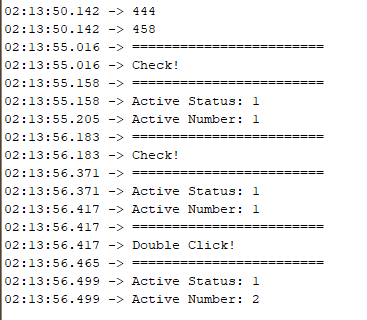

# #3 / 마우스 스위치 처리 알고리즘 구현

<br>

나는 미친놈인가 보다 진짜 얼마나 심심했으면 \
1일만에 이걸 다 만들수있는건지 진짜 궁금하다.

<br>

쨌든

<br>

## 구현 결과

하나의 스위치를 가지고 여러 Action를 집어 넣을려고 하니깐 많은 고통이 느껴졌다.

<br>

약간 트랙패드에 스위치가 하나인데 제스처까지 분석해가지고 여러 타입으로 분활하는 그런 악순환이 느껴졌다.

<br>

쨌든 지금까지 구현한것은 아래와 같다.

- 클릭
- 더블 클릭

여기까지가 내가 1일내로 만든 기능들이다.

<br>

테스트 버전으로 구현한 코드는 아래와 같다.

```arduino
bool buttonActive = false;
int buttonActiveNumber = 0;
int Setting_millisSecond = 2, button_millisSecond = 0;
int joystickX_Default = 0, joystickY_Default = 0;

void setup() {
	Serial.begin(9600);

	// 조이스틱 매인 스위치 Input
	pinMode(2, INPUT_PULLUP);

	pinMode(A0, INPUT);
	pinMode(A1, INPUT);

	for (int i = 0; i < 9; i += 1)
	{
		joystickX_Default += analogRead(A0);
		joystickY_Default += analogRead(A1);
	}

	Serial.println(joystickX_Default / 10);
	Serial.println(joystickY_Default / 10);
}

void loop() {
	if (digitalRead(2) == 0) {
		Serial.println("========================");
		if (buttonActive == false && buttonActiveNumber == 0) {
			/*님 코드는 에다가 넣으셈*/

			button_millisSecond = millis();
			buttonActive = true;
			buttonActiveNumber += 1;
			delay(175);
		} else if (buttonActive == true && buttonActiveNumber == 1 && button_millisSecond <= (millis() + 50)) {
			/*님 코드는 에다가 넣으셈*/
			buttonActiveNumber += 1;
		}
	} else if (digitalRead(2) == 1 && button_millisSecond < (millis() + 250)) {
		buttonActiveNumber = 0;
		buttonActive = false;
		button_millisSecond = 0;
	}
}
```

일반 마우스들은 이런 타이밍까지 계산해야한다라는 생각을 안했지만

<br>

이렇게 해야 동작이 되었다….

<br>

근데 서버 백엔드개발자가 하드웨어에 오랜만에 하니깐
비동기에 대한 생각이 너무 많이 들어서 어이가 털렸다.

<br>

쨌든 이코드를 실행했을때 아래와 같이 시리얼 모니터에서 출력하게 된다.

<br>



<br>

맨위에 있는 값은 조이스틱의 기본 평균값을 구했다.\
센서마다 값이 틀려서 10개의 데이터를 수집하여 평균값을 구했다.

<br>

이렇게 해서 일반 클릭, 더블 클릭을 구현하였다.